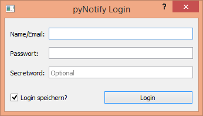

    
A GUI Projekt to get notified about new things on elitepvpers, based on PyQT and [pyepvp](https://github.com/Der-Eddy/pyepvp/).  
Currently in planning phase, let me know if you have any idea for my project!

Requirements
-------------

You'll need Python >3.4, [PyQT](https://sourceforge.net/projects/pyqt/), [pyepvp (pip package in progress)](https://github.com/Der-Eddy/pyepvp/) and some Packages from PyPI, easily installed with pip:

    pip install requests
    pip install PyExecJS
    pip install cfscrape

(OPTIONAL)You will also need to install NodeJS, if you want to bypass the Cloudflare Check  
Install Instructions can be found [here](https://github.com/joyent/node/wiki/Installing-Node.js-via-package-manager#debian-and-ubuntu-based-linux-distributions)

Build
-------------
ToDo

Screenshots
-------------

ToDo

License
-------------
    Copyright (C) 2016  Der-Eddy

    This program is free software: you can redistribute it and/or modify
    it under the terms of the GNU General Public License as published by
    the Free Software Foundation, either version 3 of the License, or
    (at your option) any later version.

    This program is distributed in the hope that it will be useful,
    but WITHOUT ANY WARRANTY; without even the implied warranty of
    MERCHANTABILITY or FITNESS FOR A PARTICULAR PURPOSE.  See the
    GNU General Public License for more details.

    You should have received a copy of the GNU General Public License
    along with this program.  If not, see <http://www.gnu.org/licenses/>.
